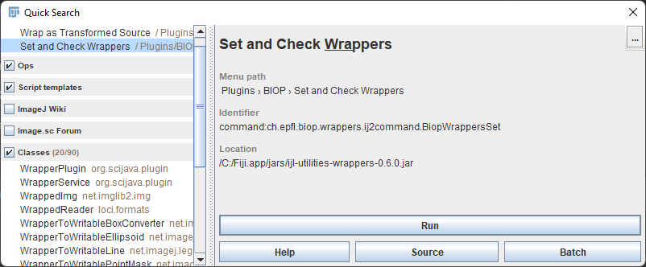
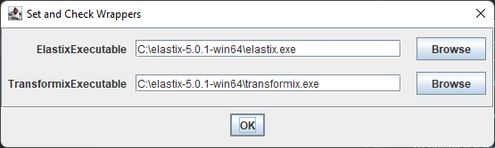

# Wrappers for FIJI

* [Cellpose](https://github.com/BIOP/ijl-utilities-wrappers/blob/master/README.md#cellpose)
* [StarDist3D](https://github.com/BIOP/ijl-utilities-wrappers/blob/master/README.md#stardist)
* [Elastix and Transformix](#elastix-and-transformix)
* Java Converter Utilities
** Images
** Rois

# Cellpose 

**NOTE** : up to cellpose 2.0

The **Cellpose** wrapper is an ImageJ2 command that enables using a working Cellpose virtual environment (either conda, or venv) from Fiji.

Briefly, **Cellpose** wrapper sequentially:
- saves the current Fiji image in a temporary folder
- starts the cellpose-env and runs Cellpose with defined parameters
- opens the created label image in Fiji
- cleans the temporary folder

## I. Installation
You'll find here some instructions to install the **_Cellpose_** wrapper and some guidance to set up a Cellpose virtual environment.

**NOTE** : if you rely on conda, the Cellpose wrapper requires to enable the conda command outside of conda prompt 
[cf installation instructions below](https://github.com/BIOP/ijl-utilities-wrappers/tree/master#-enable-conda-command-outside-conda-prompt-).

#### I.A. Cellpose Virtual Environment

You can find [instructions to install Cellpose environment on Cellpose repo](https://github.com/MouseLand/cellpose)

Please find below some  information, provided "as is" without any warranties of successful installation, nor further support.

#### I.A.1. More on venv installation

Please [find here a very detailed installation procedure with venv](https://c4science.ch/w/bioimaging_and_optics_platform_biop/computers-servers/software/gpu-deep-learning/virtualenv/).

#### I.A.2. More on conda installation

##### I.A.2.a. Windows
**NOTE** : if you rely on conda, the Cellpose wrapper requires to enable the conda command outside of conda prompt, [_cf_ installation instructions below : ](https://github.com/BIOP/ijl-utilities-wrappers/tree/master#-enable-conda-command-outside-conda-prompt-).

###### Enable conda command outside conda prompt
You need to follow this two steps procedure to enable Windows to use conda from cmd.exe.

- 1-Into the environment variable , edit PATH , add path to your ``..\Anaconda3\condabin ``default would be ``C:\ProgramData\Anaconda3\condabin``
- 2-Open a new PowerShell (and/or PowerShell (x86) ), run the following command once to initialize conda:
  `` conda init``

From now on you don't need to run a conda prompt you can simply activate a conda env from `` cmd.exe`` .

To check if it works, you can:
- 1.Press windows key, type ``cmd.exe`` (to get a command promt)
- 2.Type ``conda env list``
  You should get the list of your conda envs.

###### Conda cellpose-GPU

A successful GPU installation was possible with Win10 & NVIDIA GeForce RTX 2080 Ti, following [the detailed installation procedure described for venv](https://c4science.ch/w/bioimaging_and_optics_platform_biop/computers-servers/software/gpu-deep-learning/virtualenv/) following installation of drivers, VisualStudio, CUDA Toolkit, CuDDN before using Anaconda and the yml file below:
| CUDA Toolkit | cuDNN | cellpose | yml |
| ------------- | ------------- | ------------- | ------------- |
| [CUDA Toolkit installer 10.1](https://developer.nvidia.com/cuda-10.1-download-archive-base?target_os=Windows&target_arch=x86_64&target_version=10&target_type=exenetwork) (§)| 7.6.0 | 0.6| [cellpose_biop_gpu.yml file](https://github.com/BIOP/ijl-utilities-wrappers/raw/master/resources/cellpose_biop_gpu.yml) (§§)| 
| [CUDA Toolkit installer 11.3](https://developer.nvidia.com/cuda-11-3-1-download-archive) | [8.2.1](https://developer.nvidia.com/rdp/cudnn-archive) | 0.6 | [cellpose06_biop_gpu_113-821.yml file](https://github.com/BIOP/ijl-utilities-wrappers/raw/master/resources/cellpose06_biop_gpu_113-821.yml) |
| [CUDA Toolkit installer 11.3](https://developer.nvidia.com/cuda-11-3-1-download-archive) | [8.2.1](https://developer.nvidia.com/rdp/cudnn-archive) | 0.7| [cellpose07_biop_gpu_113-821.yml file](https://github.com/BIOP/ijl-utilities-wrappers/raw/master/resources/cellpose07_biop_gpu_113-821.yml) |

**NOTE** if you experience "tensors error" 
Current fix (from [cellpose issue](https://github.com/MouseLand/cellpose/issues/378#issuecomment-976767543)) is : 
- locate `dynamics.py`
- in `line 104` replace :  
  - `meds = torch.from_numpy(centers.astype(int)).to(device)` 
  - by
  - `meds = torch.from_numpy(centers.astype(int)).to(torch.long).to(device)`

**(§)**: nvcc is required for the installation procedure and "the cudatoolkit packages available via Conda do not include [it]" ( [more about this issue here](https://horovod.readthedocs.io/en/stable/conda_include.html)). 
To check nvcc status, you can (in a command prompt) type  ``nvcc- V``, you should get something close to :

`` nvcc: NVIDIA (R) Cuda compiler driver`` 

`` Copyright (c) 2005-2019 NVIDIA Corporation`` 

`` Built on Sun_Jul_28_19:12:52_Pacific_Daylight_Time_2019`` 

`` Cuda compilation tools, release 10.1, V10.1.243`` 

**(§§)** : a yml file subtility I learnt on this journey, you can enforce a certain channel_name::package_name

##### I.A.2.b. Mac

You can find [instructions to install Cellpose environment on Cellpose repo](https://github.com/MouseLand/cellpose) which work just fine for **CPU ONLY**.

Briefly , using the lines below:
>conda create -n cellpose
> 
>conda activate cellpose
> 
>pip install cellpose

would do the job to have a working cellpose env (in CPU mode)!

##### I.A.2.c. Linux

**_Please contact us with successful procedure_**

### I.B. Fiji - Cellpose wrapper

**NOTE** The Fiji - Cellpose wrapper is useless without a working Cellpose environment, please see installation abobe (I.A.). 
To test if you have a working Cellpose environment:
1 - Activate your environment
2 - Type `python -m cellpose --help`
You should not get an error.

- Please use our update site **_( PTBIOP | https://biop.epfl.ch/Fiji-Update/ )_** , [find more details here](https://c4science.ch/w/bioimaging_and_optics_platform_biop/image-processing/imagej_tools/update-site/).
- Restart Fiji
- ``Plugins>BIOP>Cellpose> Define Env. & prefs.`` 
  - Select the path to your working Cellpose virtual environment 
  - Select EnvType : ``conda`` or ``venv``
  - Select version : ``0.6`` , ``0.7`` , ``1.0`` or ``2.0``.

NOTE : on MacOS, for a default anaconda install and a default cellpose install path should be something like: ``/opt/anaconda3/envs/cellpose`` .
  

Congratulation you can now use Cellpose on your first image from Fiji! :)

## II. Using Fiji - Cellpose wrapper

The more "flexible" command is `Cellpose Advanced (own model)` which offers many parameters. 

BUT in case you need more parameters, this command also comes with a string field for additional parameters following pattern : `--channel_axis,CHANNEL_AXIS,--dir_above`

For convenience 3 more commands exist:
- `Segment Nuclei`, no parameter, ideal to test on blobs
- `Segment Nuclei Advanced`, some parameter available
- `Cellpose Advanced` (same parameters as command `Cellpose Advanced (own model)` without possibility to select your own model)

**NOTE** We recommand users to prepare in Fiji the minimal image to be processed by cellpose before using the plugin.
For example, from a 4 channels image (with nuclei, membrane , proteinX, ... stainings) extract the membrane and nuclei channel, make a composite and run cellpose command on it.

For more info about parameters please refer to [cellpose.readthedocs.io](https://cellpose.readthedocs.io/en/latest/settings.html#)

# StarDist

The **StarDist3D** wrapper is an ImageJ2 command that enables using a working StarDist virtual environment (either conda, or venv) from Fiji.

Briefly, **StarDist3D** wrapper sequentially:
- saves the current Fiji image in a temporary folder
- starts the stardist-env and runs stardist with defined parameters
- opens the created label image in Fiji
- cleans the temporary folder

**BIOP StarDist3D model**(s) (and training dataset) can be found on the [zenodo repository](https://zenodo.org/record/6645978#.ZB1L8nbMIQ8)

## I. Installation

You can have a look to the [StarDist installation](https://github.com/stardist/stardist#installation), but for now it works from a branch of the project (@Scripts).
Recommended way is to use yml file you can find below (or in `/resources`).

### I.A. StarDist Virtual Environment

Please find below some  information, provided "as is" without any warranties of successful installation, nor further support.

#### I.A.1. More on venv installation

Please [find here a very detailed installation procedure with venv](https://c4science.ch/w/bioimaging_and_optics_platform_biop/computers-servers/software/gpu-deep-learning/virtualenv/).

#### I.A.2. More on conda installation

##### I.A.2.a. Windows
**NOTE** : if you rely on conda, the StarDist3d wrapper requires to enable the conda command outside of conda prompt, [_cf_ installation instructions below : ](https://github.com/BIOP/ijl-utilities-wrappers/tree/master#-enable-conda-command-outside-conda-prompt-).

###### Enable conda command outside conda prompt
You need to follow this two steps procedure to enable Windows to use conda from cmd.exe.

- 1-Into the environment variable , edit PATH , add path to your ``..\Anaconda3\condabin ``default would be ``C:\ProgramData\Anaconda3\condabin``
- 2-Open a new PowerShell (and/or PowerShell (x86) ), run the following command once to initialize conda:
  `` conda init``

From now on you don't need to run a conda prompt you can simply activate a conda env from `` cmd.exe`` .

To check if it works, you can:
- 1.Press windows key, type ``cmd.exe`` (to get a command promt)
- 2.Type ``conda env list``
  You should get the list of your conda envs.

###### Conda StarDist-GPU

| CUDA Toolkit | cuDNN | Tensorflow | stardist / branch | yml |
| ------------- | ------------- | ------------- | ------------- | ------------- |
| [CUDA Toolkit installer 10.0](https://developer.nvidia.com/cuda-10.0-download-archive-base?target_os=Windows&target_arch=x86_64&target_version=10&target_type=exenetwork) ($)| 7.6.5 ($) | 1.15 ($)| 0.7.3 / @Scripts| [stardist_scripts.yml file](https://github.com/BIOP/ijl-utilities-wrappers/raw/master/resources/stardist_scripts.yml) ($)| 
| [CUDA Toolkit installer 10.0](https://developer.nvidia.com/cuda-10.0-download-archive-base?target_os=Windows&target_arch=x86_64&target_version=10&target_type=exenetwork) ($)| 7.6.5 ($) | 1.15 ($)| 0.8.3 | [stardist0.8_TF1.15.yml file](https://github.com/BIOP/ijl-utilities-wrappers/blob/master/resources/stardist0.8_TF1.15.yml) ($)| 

($) This combination CUDA Toolkit and CuDNN are required to work with Tensorflow 1.15 (lastest available on Fiji) to train model for StarDist2D.
Other combinations might work but were not tested (yet).

##### I.A.2.b. MAC OSX

The following procedure was validated on a Mac mini, M1 Chip 8-core CPU + 8-core GPU, 256GB SSD, 8GB Ram for **CPU** **ONLY** install.

First create a conda env in python 3.7 (otherwise I got issue with tensorflow)
>conda create -n stardist_py37 python=3.7

Then activate the conda env
>conda activate stardist_py37

Install tensorflow
>conda install tensorflow

Install Stardist:
>pip install stardist==0.8.3

Finally,  I ran into an issue (OMP: Error #15: Initializing libomp.dylib, but found libomp.dylib already initialized)
and I was lucky enough to found a fix using : 
> conda install nomkl

With all that I got a running conda env capable to run stardist-predict2D or -predict3D, in CPU.

### I.B. Fiji - StarDist3D wrapper

**NOTE** The Fiji - StarDist3D wrapper is useless without a working StarDist3D environment, please see installation abobe (I.A.).
To test if you have a working StarDist3D environment:
1 - Activate your environment
2 - Type `stardist-predict3d -h`
You should not get an error and see available parameters

- Please use our update site **_(PTBIOP | https://biop.epfl.ch/Fiji-Update/)_** , [find more details here](https://c4science.ch/w/bioimaging_and_optics_platform_biop/image-processing/imagej_tools/update-site/).
- Restart Fiji
- ``Plugins>BIOP>StarDist> StarDist setup...``
  - Select the path to your working StarDist virtual environment
  - Select EnvType : ``conda`` or ``venv``

NOTE : on MacOS, for a default anaconda install and a default StarDist install, the path should be something like: ``/opt/anaconda3/envs/stardist_py37`` (following the example above).

## II. Using Fiji - StarDist3D wrapper

The more "flexible" command is `StarDist3D... Advanced (own model)` which offers many parameters.

# Elastix and Transformix

Note : this bridge only supports 2D registrations. For 3D registrations using elastix in Fiji, please look at https://github.com/embl-cba/elastixWrapper.

[Elastix](https://github.com/SuperElastix/elastix) is a standalone program that performs image registration. It takes two images, a fixed and a moving one and outputs a transformation file.

The transformation file can then be used by Transformix to actually transform the moving image into the coordinates of the fixed image.

To use the wrapper, first install the [binaries of elastix](https://github.com/SuperElastix/elastix/releases/tag/5.0.1) (transformix is included) for your OS. Then, in Fiji, you can start the `Set and Check Wrappers` command:

and set the path to the elastix and transformix executable file:

You can then check whether the wrapper is working by running a [test groovy gist](https://gist.github.com/NicoKiaru/b91f9f3f0069b765a49b5d4629a8b1c7). See how it should look like in [this video](https://forum.image.sc/t/abba-experimental-a-fiji-qupath-workflow-for-mouse-brain-slice-registration-to-the-allen-brain-atlas-ccfv3/54345/28).

## Commands

A set of commands (= Fiji plugins) can now be used to register two images with Elastix. They are listed below

### Plugins>BIOP>Elastix>Register

You can select the two images to register, a fixed and a moving one, and a model, optionnally a grid size for non-rigid registration, and the command returns a deformation field ( no image transformed ).

### Plugins>BIOP>Elastix>Save Registration

The deformation field can be saved as a zip file.

### Plugins>BIOP>Elastix>Load Registration

The deformation field can be reopened from the zip file.

### Plugins>BIOP>Elastix>Inverse registration

The inverse of a deformation field can be computed with this command. You need to specify an image, which serves as defining the points over which the inverse computation will be optimized.

### Plugins>BIOP>Transformix>Transform Image

You can use this image and a transformation model to actually transform an image.

### Plugins>BIOP>Transformix>Transform Rois

You can transform ROI located in the ROI Manager according to a deformation field with this plugin.

