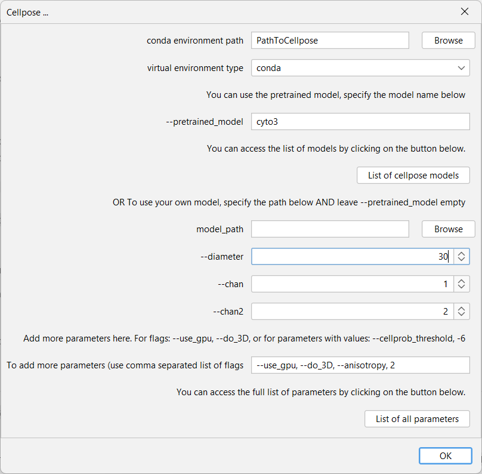
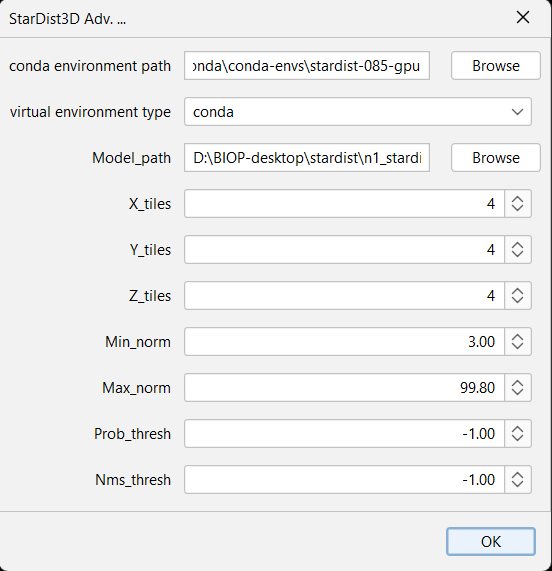
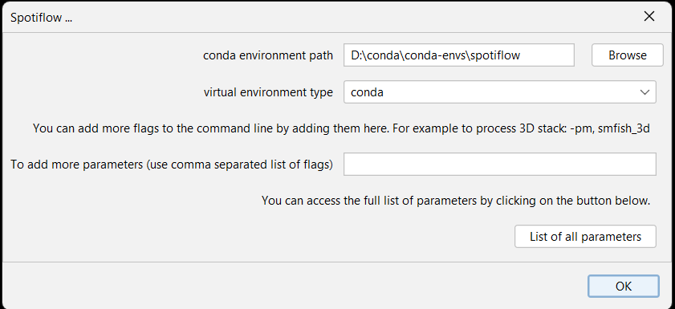

[](https://github.com/BIOP/ijl-utilities-wrappers/actions/workflows/build-main.yml)

# Wrappers for Fiji

This repository helps to set various tools external to the Java world:
- Deep learning tools via conda environments:
  - cellpose, stardist(3D), spotiflow, deepslice
- Direct executable programs:
  - elastix, transformix

On top of this, some converters that facilite the transmission of data to these external programs are part of this repository.


<!-- TOC -->
* [Wrappers for Fiji](#wrappers-for-fiji)
* [Cellpose](#cellpose-)
* [StarDist](#stardist)
* [Spotiflow](#spotiflow)
* [DeepSlice](#deepslice)
* [Elastix and Transformix](#elastix-and-transformix)
  * [Commands](#commands)
    * [Plugins>BIOP>Elastix>Register](#pluginsbiopelastixregister)
    * [Plugins>BIOP>Elastix>Save Registration](#pluginsbiopelastixsave-registration)
    * [Plugins>BIOP>Elastix>Load Registration](#pluginsbiopelastixload-registration)
    * [Plugins>BIOP>Elastix>Inverse registration](#pluginsbiopelastixinverse-registration)
    * [Plugins>BIOP>Transformix>Transform Image](#pluginsbioptransformixtransform-image)
    * [Plugins>BIOP>Transformix>Transform Rois](#pluginsbioptransformixtransform-rois)
<!-- TOC -->


# Windows installation notes

**NOTE** : if you rely on conda, the wrappers require to enable the conda command outside of conda prompt
[cf installation instructions below](#enable-conda-command-outside-conda-prompt).

## Enable conda command outside conda prompt
You need to follow this two steps procedure to enable Windows to use conda from cmd.exe.

- 1-Into the environment variable , edit PATH , add path to your ``..\Anaconda3\condabin ``default would be ``C:\ProgramData\Anaconda3\condabin``
- 2-Open a new PowerShell (and/or PowerShell (x86) ), run the following command once to initialize conda:
  `` conda init``

From now on you don't need to run a conda prompt you can simply activate a conda env from `` cmd.exe`` .

To check if it works, you can:
- 1.Press windows key, type ``cmd.exe`` (to get a command prompt)
- 2.Type ``conda env list``
  You should get the list of your conda envs.

# Cellpose

The **Cellpose** wrapper is an ImageJ2 command that enables using a working Cellpose virtual environment (either conda, or venv) from Fiji.

Briefly, **Cellpose** wrapper sequentially:
- saves the current Fiji image in a temporary folder
- starts the cellpose-env and runs Cellpose with defined parameters
- opens the created label image in Fiji
- cleans the temporary folder
- 
<details>
<summary>📄 click here to display more information </h4></summary>

## I. Installation
You'll find here some instructions to install the **_Cellpose_** wrapper and some guidance to set up a Cellpose virtual environment.

#### I.A. Cellpose Virtual Environment

You can find [instructions to install Cellpose environment on Cellpose repo](https://github.com/MouseLand/cellpose)

Please find below some  information, provided "as is" without any warranties of successful installation, nor further support.

#### I.A.2. Conda installation

##### I.A.2.a. Windows
**NOTE** : if you rely on conda, the Cellpose wrapper requires to enable the conda command outside of conda prompt, [_cf_ installation instructions](#enable-conda-command-outside-conda-prompt).

###### Conda cellpose-GPU

##### I.A.2.a. Win

You can find [instructions to install Cellpose environment on our wiki](https://wiki-biop.epfl.ch/en/ipa/mamba)

##### I.A.2.b. Mac 

You can find [instructions to install Cellpose environment on Cellpose repo](https://github.com/MouseLand/cellpose) which work just fine for **CPU ONLY**.

Briefly , using the lines below:
>conda create -n cellpose
> 
>conda activate cellpose
> 
>pip install cellpose

would do the job to have a working cellpose env (in CPU mode)!

##### I.A.2.c. Linux

Installation following Mac instructions worked for a couple of testers (no support)

### I.B. Fiji - Cellpose wrapper

**NOTE** The Fiji - Cellpose wrapper is useless without a working Cellpose environment, please see installation above. 

To test if you have a working Cellpose environment:
1. Start a terminal
2. Activate your environment
3. Type `python -m cellpose --help`

*You should not get an error ;)*

From **Fiji** : 
- Please activate our update site **_( PTBIOP | https://biop.epfl.ch/Fiji-Update/ )_** , [find more details here](https://wiki-biop.epfl.ch/en/ipa/fiji/update-site).
- Restart Fiji 

## II. Using Fiji - Cellpose wrapper

In the Fiji menu `Plugins > BIOP > Cellpose/Omnipose` one will find :
- `Cellpose ...` , to use with cellpose<=3.1.1.1
- `Cellpose SAM ...`, to use with cellpose>=4.0.0
- `Omnipose ... `

When selected commands will start a similar (yet sligthly different) GUI as pictured below : 



**NOTE** We recommend users to prepare in Fiji the minimal image to be processed by cellpose before using the plugin.
For example, from a 4 channels image (with nuclei, membrane , proteinX, ... stainings) extract the membrane and nuclei channel, make a composite image and run cellpose command on it.

For more info about parameters please refer to [cellpose.readthedocs.io](https://cellpose.readthedocs.io/en/latest/settings.html#)

Please find an example of [ImageJ macro](resources/script-templates/BIOP_wrappers/cellpose_macro.ijm) and [Groovy script](resources/script-templates/BIOP_wrappers/cellpose_script.groovy) 
</details>

# StarDist

The **StarDist3D** wrapper is an ImageJ2 command that enables using a working StarDist virtual environment (either conda, or venv) from Fiji.

Briefly, **StarDist3D** wrapper sequentially:
- saves the current Fiji image in a temporary folder
- starts the stardist-env and runs stardist with defined parameters
- opens the created label image in Fiji
- cleans the temporary folder

**BIOP StarDist3D model**(s) (and training dataset) can be found on the [zenodo repository](https://zenodo.org/record/6645978#.ZB1L8nbMIQ8)

<details>
<summary>📄 click here to display more information </h4></summary>

## I. Installation

You can have a look to the [StarDist installation](https://github.com/stardist/stardist#installation), but for now it works from a branch of the project (@Scripts).
Recommended way is to use yml file you can find below (or in `/resources`).

### I.A. StarDist Virtual Environment

##### I.A.1. Win - Conda StarDist-GPU

| CUDA Toolkit                                                                                                                                                                  | cuDNN     | Tensorflow | stardist / branch | yml                                                                                                                            |
|-------------------------------------------------------------------------------------------------------------------------------------------------------------------------------|-----------|------------|-------------------|--------------------------------------------------------------------------------------------------------------------------------|
| [CUDA Toolkit installer 10.0](https://developer.nvidia.com/cuda-10.0-download-archive-base?target_os=Windows&target_arch=x86_64&target_version=10&target_type=exenetwork) ($) | 7.6.5 ($) | 1.15 ($)   | 0.7.3 / @Scripts  | [stardist_scripts.yml file](https://github.com/BIOP/ijl-utilities-wrappers/raw/master/resources/stardist_scripts.yml) ($)      | 
| [CUDA Toolkit installer 10.0](https://developer.nvidia.com/cuda-10.0-download-archive-base?target_os=Windows&target_arch=x86_64&target_version=10&target_type=exenetwork) ($) | 7.6.5 ($) | 1.15 ($)   | 0.8.3             | [stardist0.8_TF1.15.yml file](https://github.com/BIOP/ijl-utilities-wrappers/blob/master/resources/stardist0.8_TF1.15.yml) ($) | 

($) This combination CUDA Toolkit and CuDNN are required to work with Tensorflow 1.15 (lastest available on Fiji) to train model for StarDist2D.
Other combinations might work but were not tested (yet).

#### I.A.2. MAC OSX - Conda StarDist-CPU

The following procedure was validated on a Mac mini, M1 Chip 8-core CPU + 8-core GPU, 256GB SSD, 8GB Ram for **CPU** **ONLY** install.

First create a conda env in python 3.7 (otherwise I got issue with tensorflow)
```
conda create -n stardist_py37 python=3.7
conda activate stardist_py37
conda install tensorflow
pip install stardist==0.8.3
conda install nomkl
```

### I.B. Fiji - StarDist3D wrapper

**NOTE** The Fiji - StarDist3D wrapper is useless without a working StarDist3D environment, please see installation abobe (I.A.).
To test if you have a working StarDist3D environment:
1 - Activate your environment
2 - Type `stardist-predict3d -h`
You should not get an error and see available parameters

- Please use our update site **_(PTBIOP | https://biop.epfl.ch/Fiji-Update/)_** , [find more details here](https://c4science.ch/w/bioimaging_and_optics_platform_biop/image-processing/imagej_tools/update-site/).
- Restart Fiji

## II. Using Fiji - StarDist3D wrapper

## II. Using Fiji - Cellpose wrapper

In the Fiji menu `Plugins > BIOP > Cellpose/Omnipose` one will find :
- `StarDist2D...`
- `StarDist2D Adv. ...`
- `StarDist3D...`
- `StarDist3D Adv. ...`

For example the command `StarDist3D Adv. ...` offers many parameters.



</details>

# Spotiflow

The **Spotiflow** wrapper is an ImageJ2 command that enables using a working Spotiflow virtual environment (either conda, or venv) from Fiji.

Briefly, **Spotiflow** wrapper sequentially:
- saves the current Fiji image in a temporary folder
- starts the spotiflow-env and runs spotiflow with defined parameters
- populates the RoiManager with detected spots as points (2D, 3D , + time )
- cleans the temporary folder

NOTE : does not support multi-channels images for now.

<details>
<summary>📄 click here to display more information </h4></summary>

## I. Installation

You can have a look to the [Spotiflow installation](https://github.com/weigertlab/spotiflow)



## II. Using Fiji - Spotiflow wrapper

In the Fiji menu `Plugins > BIOP > Spotiflow` one will find :
- `Spotiflow ...` 

</details>

# DeepSlice

[DeepSlice](https://github.com/PolarBean/DeepSlice) is a python library which automatically aligns mouse histology with the allen brain atlas common coordinate framework.

You'll find here some instructions to install the **_DeepSlice_** wrapper and some guidance to set up a DeepSlice virtual environment.

**NOTE** : the DeepSlice wrapper requires to enable the conda command outside of conda prompt
[cf instructions](#enable-conda-command-outside-conda-prompt).

<details>
<summary>📄 click here to display more information </h4></summary>

## I. Installation

The DeepSlice wrapper requires a functioning conda environment with the DeepSlice library.

#### I.A. Conda installation

You need to install DeepSlice in a conda env that has python 3.7 (versions above do not work). You need to create an environment and install DeepSlice with pip. 

```
conda create -n deepslice python=3.7
conda activate deepslice
conda install pip
pip install DeepSlice==1.1.5 # pinned version for which this wrapper has been tested
pip install urllib3==1.26.6 # see https://github.com/PolarBean/DeepSlice/issues/46
```

##### I.A.2.a. Windows
**NOTE** : if you rely on conda, the DeepSlice wrapper requires to enable the conda command outside of conda prompt, [_cf_ installation instructions](#enable-conda-command-outside-conda-prompt).

###### Enable conda command outside conda prompt
You need to follow this two steps procedure to enable Windows to use conda from cmd.exe.

- 1-Into the environment variable , edit PATH , add path to your ``..\Anaconda3\condabin ``default would be ``C:\ProgramData\Anaconda3\condabin``
- 2-Open a new PowerShell (and/or PowerShell (x86) ), run the following command once to initialize conda:
  `` conda init``

From now on you don't need to run a conda prompt you can simply activate a conda env from `` cmd.exe`` .

To check if it works, you can:
- 1.Press windows key, type ``cmd.exe`` (to get a command prompt)
- 2.Type ``conda env list``
  You should get the list of your conda envs.

##### I.A.2.b. Mac

Nothing particular should be needed, but it has not been tested.

##### I.A.2.c. Linux

Nothing particular should be needed, but it has not been tested.


## II. Using Fiji - DeepSlice wrapper

This wrapper essentially enables to run DeepSlice locally from within [ABBA](https://biop.github.io/ijp-imagetoatlas/).

You can set up the location of the environment with the command `Plugins>BIOP>DeepSlice>DeepSlice setup...`

</details>

# Elastix and Transformix

Note : this bridge only supports 2D registrations. For 3D registrations using elastix in Fiji, please look at https://github.com/embl-cba/elastixWrapper.

[Elastix](https://github.com/SuperElastix/elastix) is a standalone program that performs image registration. It takes two images, a fixed and a moving one and outputs a transformation file.

The transformation file can then be used by Transformix to actually transform the moving image into the coordinates of the fixed image.

<details>
<summary>📄 click here to display more information </h4></summary>

To use the wrapper, first install the [binaries of elastix](https://github.com/SuperElastix/elastix/releases/tag/5.0.1) (transformix is included) for your OS. Then, in Fiji, you can start the `Set and Check Wrappers` command:


and set the path to the elastix and transformix executable file:


You can then check whether the wrapper is working by running a [test groovy gist](https://gist.github.com/NicoKiaru/b91f9f3f0069b765a49b5d4629a8b1c7). See how it should look like in [this video](https://forum.image.sc/t/abba-experimental-a-fiji-qupath-workflow-for-mouse-brain-slice-registration-to-the-allen-brain-atlas-ccfv3/54345/28).

## Commands

A set of commands (= Fiji plugins) can now be used to register two images with Elastix. They are listed below

### Plugins>BIOP>Elastix>Register

You can select the two images to register, a fixed and a moving one, and a model, optionnally a grid size for non-rigid registration, and the command returns a deformation field ( no image transformed ).

### Plugins>BIOP>Elastix>Save Registration

The deformation field can be saved as a zip file.

### Plugins>BIOP>Elastix>Load Registration

The deformation field can be reopened from the zip file.

### Plugins>BIOP>Elastix>Inverse registration

The inverse of a deformation field can be computed with this command. You need to specify an image, which serves as defining the points over which the inverse computation will be optimized.

### Plugins>BIOP>Transformix>Transform Image

You can use this image and a transformation model to actually transform an image.

### Plugins>BIOP>Transformix>Transform Rois

You can transform ROI located in the ROI Manager according to a deformation field with this plugin.

</details>
